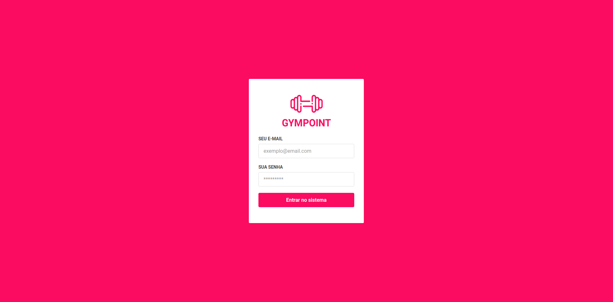
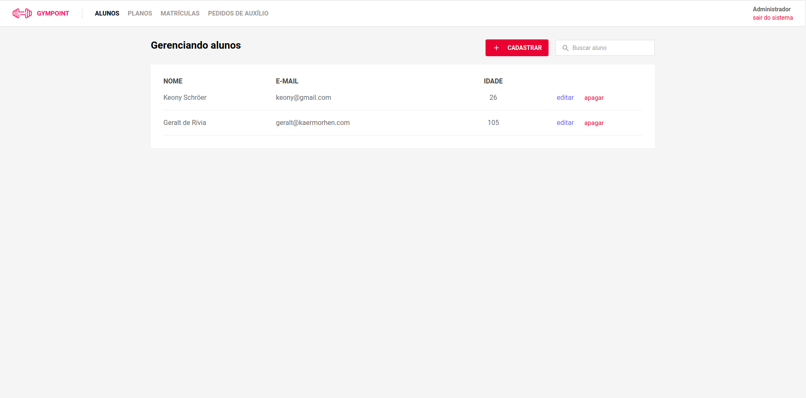
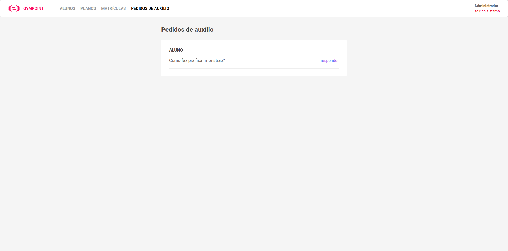
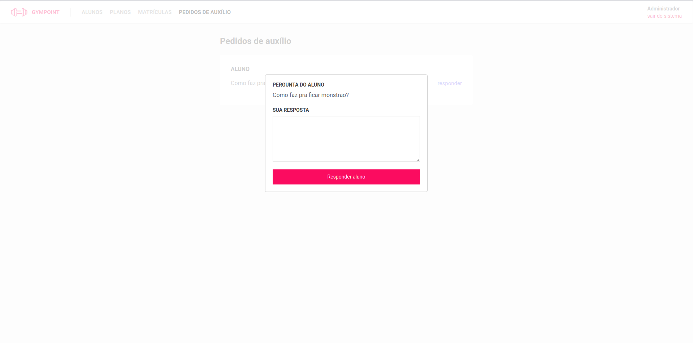

# Gympoint

:muscle: Full stack project made with React JS, React Native and Node JS.






## Running Locally

Navigate to backend folder and run

```sh
yarn install
```

Copy .env.example file, rename to just ".env" and edit the enviroment variables
After that you should navigate to frontend folder and run

```sh
yarn install

# start the app on a new terminal window
yarn start
```

Runs the app in development mode.<br>
Open [http://localhost:3000](http://localhost:3000) to view it in the browser.
